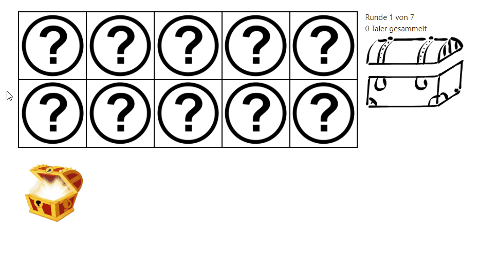
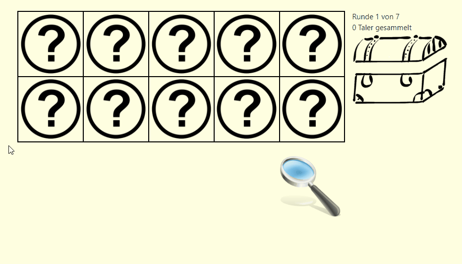
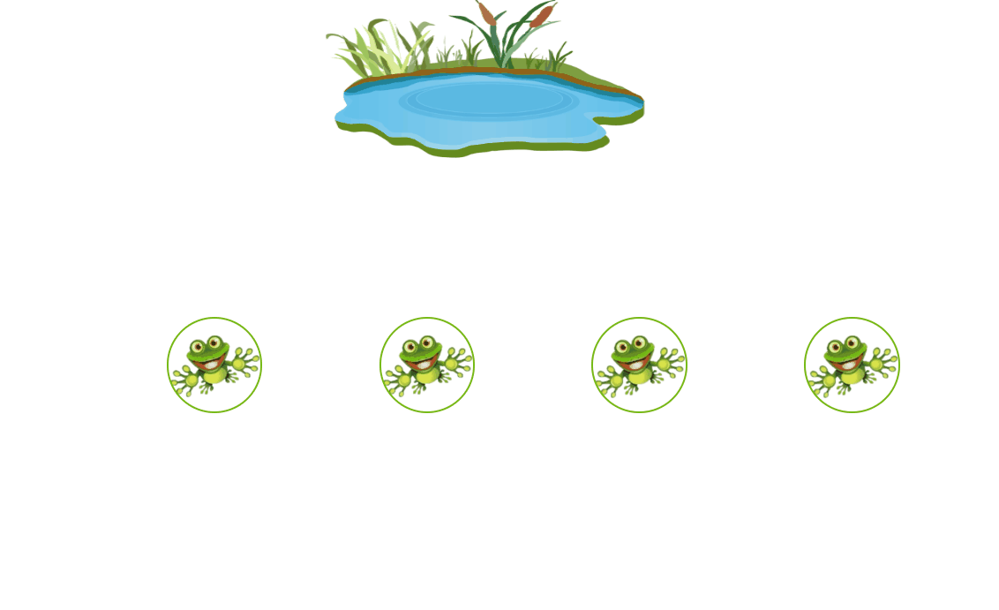
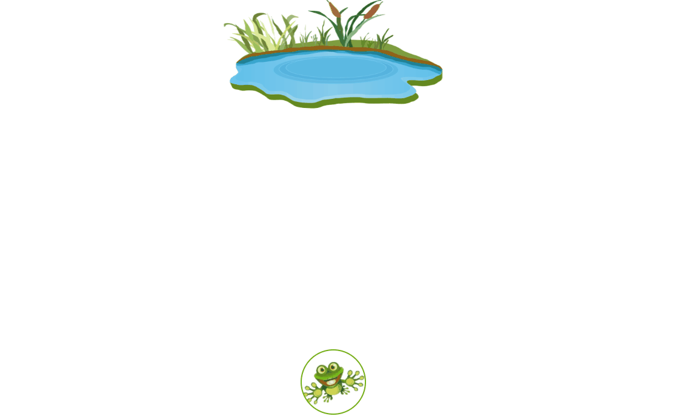
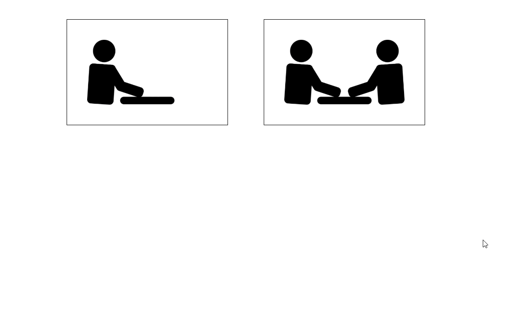
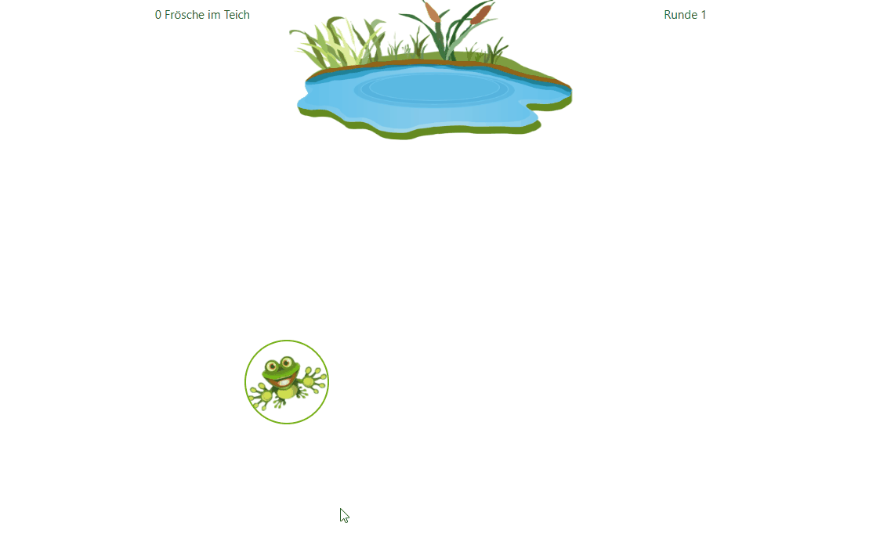

# oTree apps
This repository features some games that are executable with oTree. [oTree](http://www.otree.org) is an extension of the Django framework to build web applications tailored for experimental research purposes.

Included apps:
- [Devil's Task](#devils-task)
- [Frog](#frog)
- [Time Preference](#time-preference)

### Prerequisites
If you have Python 3 already installed, you only need to run `pip3 install -U otree` in a terminal.

In all other cases please work your way through the [installation guidelines for oTree](https://otree.readthedocs.io/en/latest/install.html)

### Start an app
Clone or download this repository to your device. Open a terminal window (e.g. PowerShell on Windows), navigate inside the repository's directory and enter `otree devserver`. Open your browser and enter http://127.0.0.1:8000 or http://localhost:8000 in the address bar. You will have access to invitation links for participants in the same network. If you instead see a message that your database is not ready, try running `otree resetdb` in the terminal window and confirm with `y`, then run `otree devserver` again.

Remark: While this works for a small number of concurrent participants in a local network, you might want to consider hosting the application on a server. Read the [corresponding chapter in the oTree documentation](https://otree.readthedocs.io/en/latest/server/intro.html) for further details.

# App overview

## Devil's Task
The player is shown 10 mysterious fields that he can uncover by clicking on them. 9 of the 10 fields will reveal a coin, but behind the other remaining field hides the devil (randomly chosen). The goal is to collect as many coins as possible. Before the player can play the game, he gets audio instructed on the rules:

Remark: The start button triggers an interaction with the website to enable audio autoplay (Google Chrome).

The game has two modes. In "one by one" the player gets instant feedback about the other side of the field. With a click on the treasure chest he collects the currently revealed coins. However, if the devil appears, all revealed coins are lost and the next round starts:

In "all at once" (slightly colored background) the player has to decide beforehand how many fields should be revealed. He finalizes his decision by clicking on the magnifying glass:

## Frog
The player helps some frogs jump into a pond - optionally against another player.

At first, the player is instructed on how to let the frog jump. Depending on where on the frog the player clicks/touches, the frog jumps either a short or long distance to the left or the right. The player can then try the controls with 10 test jumps:

In the game, the player will successively be presented with ten frogs at a random spot on the field. The goal is to let the frog jump into the pond. A successful landing is signaled with a _splash_ noise and a disappearing frog. If the pond is missed, the frog will make a _quak_ noise and jump back. The player can choose one of two game modes:
1. Single player (zen mode): You play on your own, every frog in the pond results in one earned coin.
2. Multi player (competitive mode): You play against another player. Your result will be compared to the other player. The matching is randomly, it could also be a single player. If you landed more frogs in the pond than the other player you will receive 20 coins. If there is a tie, you will receive 10 coins. Otherwise you will receive no coins at all.

These rules are displayed to the player upfront:

The player then decides which mode to play by clicking on a field. If he chooses multi player he will also be asked if he thinks the other player will score less or more than him:

Both single (left) and multi (right) player will be shown how much coins they earned at the end of the game. Additionally, the multi player will be shown how much frogs his opponent landed in the pond:

## Time Preference

A rather simplistic game: The player must decide between receiving one coin right after the game (left side) or a varying disbursement in one week (right side). There are 5 decisions to make of which one gets chosen at random to determine the payoff. The player is audio instructed on these rules:

Then the player makes his decisions by clicking on the left or right coin(s). Afterwards, the red arrows stop at one decision at random. This will become the payoff (in this case receiving one coin directly after the game):

# Links
[oTree on GitHub](https://github.com/oTree-org) (for the curious)

# Disclaimer
If you publish research conducted using oTree, you are required by the oTree license to cite [this paper](http://dx.doi.org/10.1016/j.jbef.2015.12.001). (Citation: Chen, D.L., Schonger, M., Wickens, C., 2016. oTree - An open-source platform for laboratory, online and field experiments. Journal of Behavioral and Experimental Finance, vol 9: 88-97)
